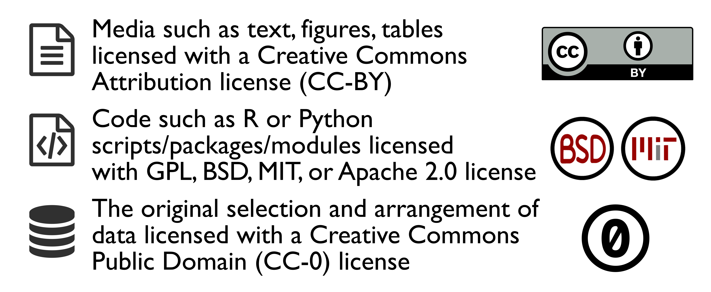
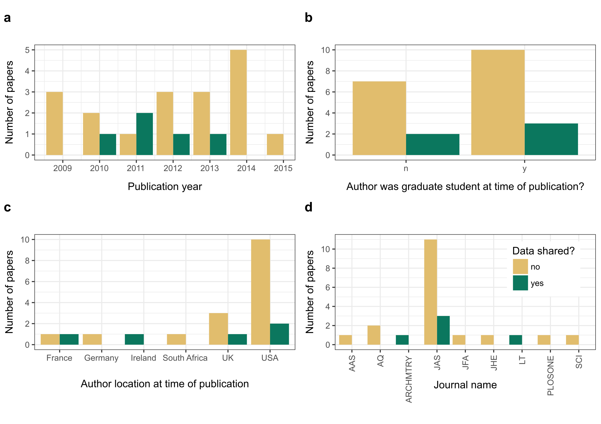
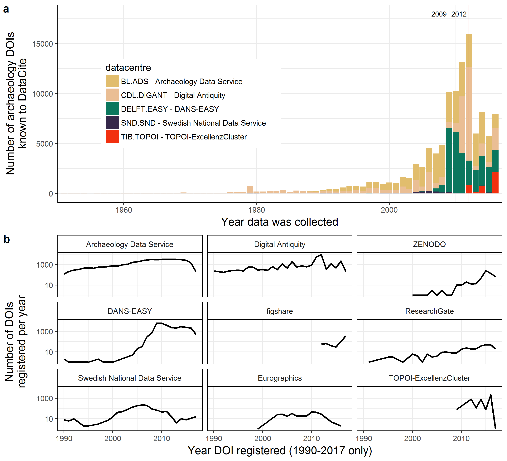
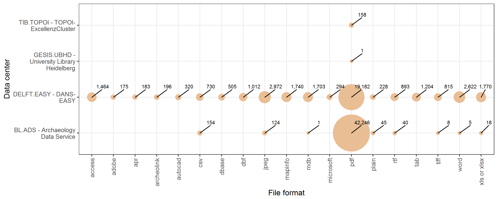
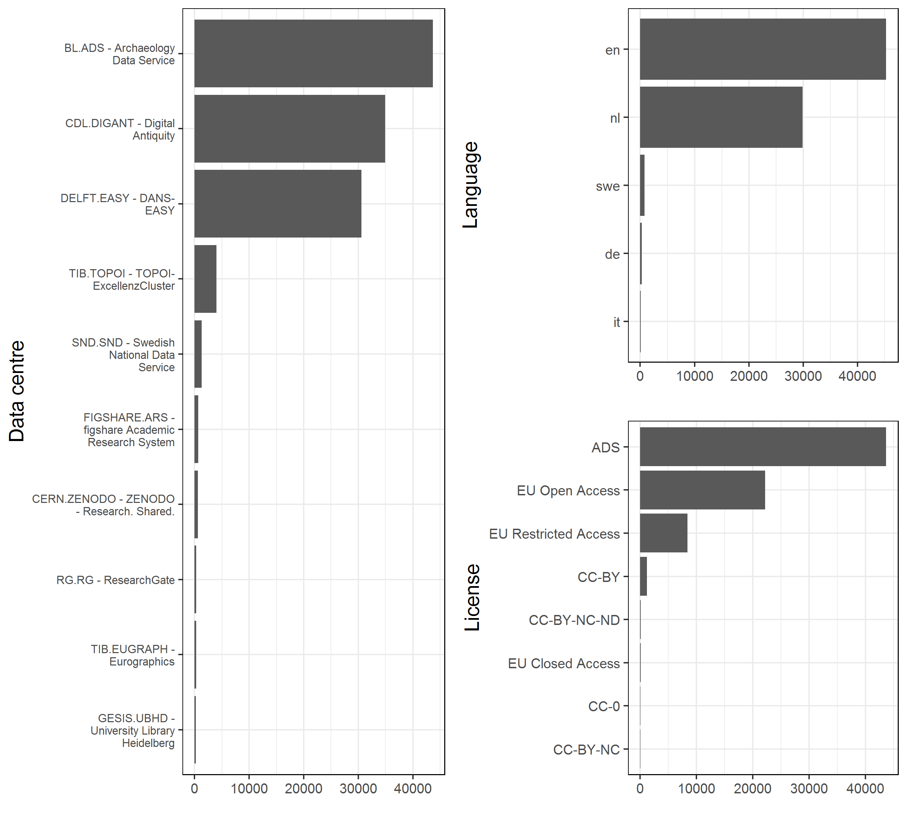
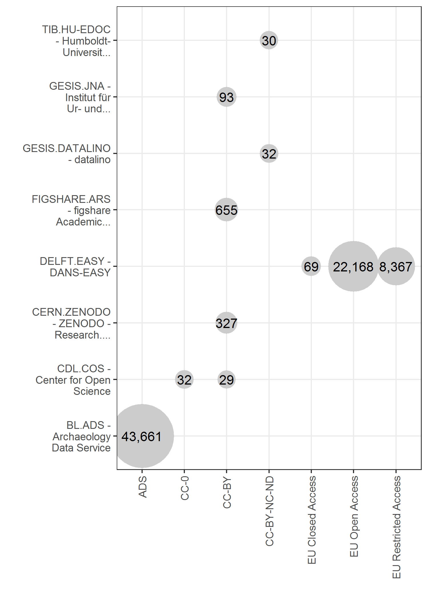

```{r, setup2, echo = FALSE}
knitr::opts_chunk$set(
  collapse = TRUE,
  warning = FALSE,
  message = FALSE,
  echo = FALSE,
  eval = TRUE,
  comment = "#>",
  fig.path = "../figures/"
)

library(datacitation)

# my custom plot theme
theme_new <- function(base_size = 12){
  theme_bw(base_size = base_size) %+replace%
    theme(
      #axis.title.x=element_blank(),
      # axis.title.y=element_blank(),
      axis.title = element_text(size = 14),
      legend.key=element_rect(colour=NA, fill =NA),
      # panel.grid = element_blank(),   
      panel.border = element_rect(fill = NA, colour = "black", size=0.5),
      panel.background = element_rect(fill = "white", colour = "black"), 
      strip.background = element_rect(fill = NA)
    )
}

```


# Introduction

Data are the building blocks of research, and access to data is necessary to fully understand and extend the work of others (Fienberg et al 1985). Yet archaeological data are often not available for a variety of reasons, including a perceived lack of credit for making data available. The goal of this paper is to present a standard for the scholarly citation of archaeological data, akin to the way we cite publications. The need for this has been motivated by Huggert’s (2017) findings of low levels of data citation and reuse in archaeology, and Clarke’s (2015) analysis that digital data preservation and management systems are under-developed in archaeology, despite our obligations as stewards of cultural heritage. A standard for data citation is important because it gives credit to the authors or compilers of the data, and so accords them visibility and recognition for their scholarly contribution in a way that is valued broadly in the discipline. A citation standard is also important for tracking the use of the data, and generating metrics about the impact of the dataset on the discipline. Understanding the use of resources such as datasets is important for allocating resources within the discipline and identifying novel research directions.

We will start by defining what we mean by ‘data’, and reviewing previous work on researchers’ attitudes to sharing data. We motivate data sharing and citing behaviours by explaining why data sharing is beneficial to archaeology as a discipline, and to individual researchers. Then we will survey some of the data sharing and citing norms that have emerged in other research areas. From these norms we will present a standard suitable for citation of archaeological data. Finally, we will present some basic instructions on how to share archaeological data.

# What are data? 

Defining what data are is an ongoing research problem for information scientists (Leonelli 2016; Borgman 2012). Table \@ref(tab:summary-of-defs-of-data) summarises some of the definitions debated in the philosophy of science literature. A more concrete starting point is this definition from the National Academies of Sciences: 

"The term “data” as used in this document is meant to be broadly inclusive. In addition to digital manifestations of literature (including text, sound, still images, moving images, models, games, or simulations), it refers as well to forms of data and databases that generally require the assistance of computational machinery and software in order to be useful, such as various types of laboratory data including spectrographic, genomic sequencing, and electron microscopy data; observational data, such as remote sensing, geospatial, and socioeconomic data; and other forms of data either generated or compiled, by humans or machines." (Uhlir & Cohen, 2011, cited in Borgman 2015)

```{r summary-of-defs-of-data}
tbl <- readr::read_csv("../figures/tbl_definitions_of_data.csv")
knitr::kable(tbl, caption = "A selection of defintions of research data")
```

This is a useful definition because it emphasizes data as digital manifestations, and so suitable for transmission, storage and retrieval using the internet. Physical objects (such as samples, collections, hard copies of notes, etc.) are data also, but they are out of scope of this discussion because of the different requirements for access, archiving, and so on. For many archaeologists, data are the contents of the files we use to generate visualisations, summary tables, and qualitative statements that appear in, and support the claims we make in, our scholarly publications and reports. The categories shown in Table \@ref(tab:types-of-data) are useful as a rough guide to what data can be, although this table is not comprehensive, and does not represent the full diversity of data used by archaeologists. Ultimately, data are whatever the community decides, as the The National Science Foundation notes in their commentary on Data Management Plans: "What constitutes such data will be determined by the community of interest through the process of peer review and program management. This may include, but is not limited to: data, publications, samples, physical collections, software and models." This is a highly pragmatic approach to defining data, but is also consistent with the relational account of data in philosophy of science scholarship, which holds that what data are is dependant on who uses it, how and for what purpose (Leonelli 2015; Daston and Galison 1992). It implies that the answer to the question of what counts as data is mostly emergent from our professional interactions, such as the materials we request when we do peer review of manuscripts and grant proposals, or when we make an informal request for more information by email.  Our citation standard imposes no constraints on what data can be, but we propose a few minimal qualities for how data should be organised that will help ground our discussion. Table \@ref(tab:desirable) summarises some desirable minimum qualities for archaeological data that optimise its discovery and reuse. 

```{r types-of-data}
tbl <- readr::read_csv("../figures/tbl_types_of_data_nsb.csv")
knitr::kable(tbl, caption = "A selection of types of data encountereed by archaeologists.")
```

```{r desirable}
tbl <- readr::read_csv("../figures/tbl_rules_of_data_sharing.csv")
knitr::kable(tbl, caption = "Best practices for preparing data for sharing, from Hart et al. (2016) ")
```

# What are the benefits of data sharing to the individual researcher?

While public and community benefits and costs are well-rehearsed and widely agreed on (Table \@ref(tab:costsbenefits)), they offer no, or only weak, tangible incentives to the individual researcher (Rowhani-Farid et al. 2017). Previous work has identified citation advantages as a tangible benefit to individual researchers who share data with publications, although the magnitude of the advantage varies greatly (see Table \@ref(tab:indivbenefits) for a summary). Increased publication productivity also appeared to be associated with data sharing behaviours. Across over 7,000 NSF and NIH awards, Pienta et al. (2010) reported that research projects with archived data produced a median of 10 publications, versus only five for projects without archived data.

```{r costsbenefits}
tbl <- readr::read_csv("../figures/tbl_reasons_to_share_data.csv")
knitr::kable(tbl, caption = "Summary of public and community benefits and costs of data sharing")
```

```{r indivbenefits}
tbl <- readr::read_csv("../figures/tbl_evidence_of_sharing_benefits.csv")
knitr::kable(tbl, caption = "Summary of individual benefits to data sharing")
```

# What do researchers think about sharing data?

Sharing of data is a quality that is fundamental to the definition of science (cf. Merton’s (1942) communalism norm, where intellectual property rights are normally given up in exchange for recognition and esteem) and to data both as an abstract quality (cf. the definitions in Table \@ref(tab:summary-of-defs-of-data) that mention data as ‘portable’, ‘stable across different domains’) and as a concrete detail to be managed with policy. For example, for over a decade the National Science Foundation (2016) has had a data sharing policy that states "Investigators are expected to share with other researchers, at no more than incremental cost and within a reasonable time, the primary data, samples, physical collections and other supporting materials created or gathered in the course of work under NSF grants. Grantees are expected to encourage and facilitate such sharing." Surveys of researchers across different domains repeatedly show that people value the ideal of data sharing (Kratz and Strasser 2015). However, data sharing is not widespread in many disciplines, raising questions about why researchers do or do not share their data. Three recent studies have attempted to answer these questions, in the search for strategies to encourage sharing. 

Stodden (2010) surveyed registrants at a top machine learning conference (the Neural Information Processing Systems (NIPS) conference) to identify the factors that affect researchers’ decisions to reveal data (Table \@ref(tab:costsbenefits)). Stodden found that communitarian factors influence scientists to share their data, but private incentives determine when scientists choose not to share their code and data. In the top three reasons not to share, we see a lack of incentives to invest time in data sharing (however, there are many other time-consuming tasks in research, and they get done because clear reward structures are in place); a lack of faith in data citation (which we hope this paper will help with); and a lack of an efficient copyright process. Stodden’s (2009a, b) ‘Reproducible Research Standard’, summarised in Figure \@ref(fig:stodden-rrs), is a convenient and robust copyright schema that is in wide use for many typical research projects. 

```{r stodden-rrs, fig.cap="Summary of Stodden’s (2009b) 'Reproducible Research Standard'"}

```

Other surveys have found similar results. Tenopir et al. (2011) received 1,329 responses to a survey conducted by the research team of the National Science Foundation-funded DataONE project. They found that when researchers did not share data it was due to reasons that include: insufficient time (54%), a lack of funding (40%), having no place to put the data (24%), a lack of standards (20%), and because their sponsor did not require it (17%). A remarkable observation by Tenopir et al. is that while 75% of respondents say they share data, only 36% of those respondents say their data are easy to access, while only 6% say they make all their data available. This suggests that most data sharing occurs in private directly between individual researchers, rather than in public via open repositories. A similar focus on private, peer-to-peer sharing is evident in interviews conducted by Wallis et al. (2013) with 43 researchers at the Center for Embedded Networked Sensing. They found that the most commonly cited conditions for sharing data were (1) first rights to publish results, (2) proper attribution to the data source, (3) familiarity between sharer and recipient, (4) funding agency expectations, and (5) the amount of effort required to share. 

# What are the current norms of data sharing?

The surveys above show that data sharing practices tend to be a private activity, but where public sharing does occur, what forms does it take, and how to these vary across different fields of research?  Wouters and Haak (2017) surveyed 1,200 researchers about data sharing behaviours and found a spectrum from ‘intensive data-sharing fields’ to ‘restricted data-sharing fields’. Intensive data-sharing fields often depend on access to global databases, for example human genetics, while restricted data-sharing fields depend mostly on data collected by the individual researcher or their immediate collaborators, such as digital humanities. These differences in disciplinary norms have implications for data ownership (intensive: collectively owned, willing to share; restrictive: owned by the individual, reluctant to share) and the effort required to share (intensive: low effort because data are prepared for sharing as an integral part of the research process, restrictive: high effort because data are prepared for sharing after the research, or apart from it, in response to a request from another researcher). Archaeologists can be found all over this spectrum because of the diversity of archaeological research, however, our view is that archaeology is, for the most part, currently a restricted data-sharing field. There are few standardised and widely used methods for sharing and citing data, a challenge for archaeological data sharing that we hope this paper will help to address. 

Even though there is a wide spectrum of data sharing behaviours, from intensive to restrictive, overall rates of data sharing are very low in many fields. Wicherts et al. (2006) emailed authors of 141 empirical articles recently published by the American Psychological Association (APA) journals to request a copy of the original data reported in the articles. They received 64 of the 249 datasets they requested, resulting in a data sharing rate of about 26%, despite all the authors of the articles in their study being bound to the APA's Ethical Principles, which state authors must ‘not withhold the data on which their conclusions are based from other competent professionals who seek to verify the substantive claims’ (American Psychological Association, 2001, p. 396). Valpaemel et al. (2015) similarly requested data from 394 papers, published in all issues of four APA journals in 2012 and found that 38% of authors responded with their data. They concluded that although the data sharing rate increased as compared to the study by Wicherts et al., their findings are ‘worrisome’ and indicate a 'poor availability of data'.

Savage and Vickers (2009) requested data from authors of ten papers published in PLOS journals, and received only one reply. Although this is a very small sample, it is notable because PLOS journals require authors to share data as a condition of publication: "PLOS journals require authors to make all data underlying the findings described in their manuscript fully available without restriction, with rare exception." (PLoS Medicine Editorial and Publishing Policies nd), and yet only one out of the ten authors actually complied with this requirement. Alsheikh-Ali et al. (2011) inspected 500 articles published in high-impact science journals in 2009 and found that only 47 papers (9%) deposited full primary raw data online. Similarly, Womak (2015) inspected 4,370 articles published in high-impact science journals in 2014 and found that 13% of articles with original data published make the data available to others.  

The absence of a standardised and sustainable approach to data sharing is starkly demonstrated by Vines et al.’s (2014) study of data availability over time in biology publications. They examined the availability of data from 516 studies of plants or animal morphology between 2 and 22 years old. Vines et al. found that odds of a data set referred to in a publication being available fell by 17% per year. The found that the key factors responsible for the unavailability of data was that the data were lost or on inaccessible storage media. 

# Do archaeologists share data?

Here we present the results of three small pilot studies aimed at understanding how archaeologists share their data. First, we emailed a sample of authors of research publications to request access to the data behind their publication. Second, we surveyed a sample of journal articles to see what data was available. Third, we analysed information about archaeological data files in online repositories tracked by DataCite (an organisation that provides persistent identifiers, or DOIs for research data). The small sample sizes of the first two of these pilot studies limit how generalisable the results are, but as the first of their kind for archaeology, they are valuable for proposing hypotheses for larger-scale investigations.

## Reproducibility and open source materials for this study

To enable re-use of our materials and improve reproducibility and transparency according to the principles outlined in Marwick (2017), we include the entire R code used for all the analysis and visualizations contained in this paper in our compendium at http://dx.doi.org/10.17605/OSF.IO/KSRUZ. Also in this version-controlled compendium are the raw data for all the tests reported here. All of the figures and quantitative results presented here can be independently reproduced with the code and data in this repository. In our compendium our code is released under the MIT licence, our data as CC-0, and our figures as CC-BY, to enable maximum re-use (for more details, see Marwick 2017).

## Email requests for data in a published article

Our sample of authors that we wrote email to focused on _Journal of Archaeological Science_ articles on experiments with stone artefacts that were published during 2009 and 2015. We focused on stone artefact experiments because the all research materials in these projects are generated by the researcher, so there are no other stakeholders to consider when determining how to share the data: the researcher has complete control over the data. There are also no risks of damage to people or property in sharing these data because they do not include archaeological sites or human subjects. In contacting the authors, we requested the datasets for use in a graduate seminar with the aim of reproducing the published results and further exploring the data (this stage is still in progress). We promised to contact the authors if we discovered anything new, and not to share the data further without their permission. The data included with this paper is anonymised so the specific authors we contacted are not identifiable.

```{r import-email-data}
library(tidyverse)
email_survey <- readr::read_csv("../data/raw_data/email_survey.csv")

# overall rate of response
emails_out <- sum(!is.na(email_survey$`email sent date`))
emails_back <- sum(!is.na(email_survey$`response received date`))
email_response_rate <- round(emails_back / emails_out, 1) * 100
data_items_received <-  sum(!is.na(email_survey$`content recieved date`))
sharing_rate <-  round(data_items_received / emails_out, 1) * 100
```

Our sample focused on _Journal of Archaeological Science_ articles on experiments with stone artefacts that were published during `r min(email_survey$'publication year', na.rm = TRUE)` and `r max(email_survey$'publication year', na.rm = TRUE)`. We focused on stone artefact experiments because the all research materials in these projects are generated by the researcher, so there are no other stakeholders to consider when determining how to share the data: the researcher has complete control over the data. There are also no risks of damage to people or property in sharing these data because they do not include archaeological sites or human subjects. In contacting the authors, we requested the datasets for use in a graduate seminar with the aim of reproducing the published results and further exploring the data (this stage is still in progress). We promised to contact the authors if we discovered anything new, and not to share the data further without their permission. The data included with this paper is anonymised so the specific authors we contacted are not identifiable. 

We sent out emails to the first authors of `r emails_out` stone artefact experiment papers, and recieved `r emails_back` replies, resulting in a `r email_response_rate`% response rate. We recieved `r data_items_received` responses that included data files, giving an overall sharing rate of `r sharing_rate`%. Our small sample size limits the robustness of our analysis, but points to some observations that may be worth following up in a larger study. We found no clear relationship of data sharing and date of publication. We do not have any insights into why authors of older papers decline to share, but three of the six responses for papers published in 2014-2015 said they declined to share data because they intend to use these data in a future publication. Other noteworthy reasons provided by respondents for declining to share include the author about to defend their thesis or about to go on vacation. We interpret these to mean that the author does not have time to prepare their data for sharing, perhaps because the data are not already in a well-organised for ready for distribution. We found no effect on the author's student status at time of publication on data sharing behaviours, with roughly equal proportions of students and non-students sharing and not sharing. 

Similarly there are no clear patterns data sharing of among different journals. It is remarkable that the authors of the one PLOS One paper we contacted declined to share because that refusal violates the policy of that journal at the time of publication of that paper (early 2014): "Publication is conditional upon the agreement of the authors to make freely available any materials and information described in their publication that may be reasonably requested by others for the purpose of academic, non-commercial research." Chambers' (2017) examined 50 PLOS One papers on brain images published in November 2014 - May 2015 and found that only 38% of these papers archived their data in an open repository. Similarly, Nuijten et al. (2017) found that of 462 PLOS One articles that promised data availability, 29% of these did not have any available data. Unfulfilled promises to share data are not unique to PLOS One (Kidwell et al. 2016), but these studies highlight the need to resolve ambiguity among authors about what counts as data, and for editors and peer reviwers to more critically assess whether an author has been made their data openly available. 

We see similar rates of sharing in response to email requests among archaeologist to what have been described in other disciplines (Table \@ref(tab:sharing-rates), Tenopir et al. 2015; Vanpaemel et al. 2015). However, our result may overestimate the true rate because our sample did not include datasets that authors might not be able or willing to share because they contain sensitive location or cultural information. Analysis of the qualitative responses suggests two key reasons why author are reluctant to share: they are fearful that they will lose the opportunity to produce further publications from those data, and that their data is not in a form suitable for sharing and the task of organising those data is not a high priority. These reasons not to share have also been documented in other research areas. The absence of patterns in the date of the paper, student status of the author and other variables may relate to more to our small sample size than a real absence of relationships in data sharing behaviour. 

```{r sharing-rates}
tbl <- readr::read_csv("../figures/tbl_studies_of_data_sharing.csv")
knitr::kable(tbl, caption = "Summary of a selection of previous studies of data sharing in various fields, from Spencer (2010). In the study by Peng et al., the authors did not attempt to contact other researchers, but noted the availability of data as described in the published article.")
```

```{r date-and-sharing, fig.cap="There is no obvious trend in data sharing becavious and date of publication"}
library(viridis)
years <- seq(min(email_survey$'publication year', na.rm = TRUE),
    max(email_survey$'publication year', na.rm = TRUE), 1)

sharing_by_year <- 
email_survey %>% 
  filter(!is.na( `email sent date`)) %>% 
  group_by(`publication year`, `content recieved date`) %>% 
  tally() %>% 
  filter(!is.na(`publication year`)) %>% 
  mutate(`content recieved date` = if_else(!is.na(`content recieved date`), 
  "yes", "no")) %>% 
  ggplot(aes(`publication year`, n)) +
    geom_col(aes(fill = `content recieved date`),
             # need devtools::install_github("tidyverse/ggplot2") for this
             position = position_dodge(preserve = 'single')) +
    scale_fill_viridis(discrete = TRUE,
                       guide = FALSE) +
    scale_x_continuous(breaks = years,
                       labels = years) +
  xlab("Publication year") +
    theme_bw() +
  coord_fixed(ratio = 0.5)

```

```{r student, fig.cap="No relationship between student status and data sharing behaviour"}
sharing_by_student <- 
email_survey %>% 
  filter(!is.na( `email sent date`)) %>% 
    mutate(`content recieved date` = if_else(!is.na(`content recieved date`), 
  "yes", "no")) %>% 
  group_by(
  `author is graduate student at time of publication?`, 
  `content recieved date`) %>% 
  tally() %>% 
  filter(!is.na(`author is graduate student at time of publication?`)) %>% 
  ggplot(aes(`author is graduate student at time of publication?`, n)) +
    geom_col(aes(fill = `content recieved date`),
             position = position_dodge(preserve = 'single')) +
    scale_fill_viridis(discrete = TRUE,
                       guide = FALSE) +
    xlab("Author was graduate student at time of publication?") +
    theme_bw() +
  coord_fixed(ratio = 0.05)
```

```{r author-country}
sharing_by_country <- 
email_survey %>% 
  filter(!is.na( `email sent date`)) %>% 
    mutate(`content recieved date` = if_else(!is.na(`content recieved date`), 
  "yes", "no")) %>% 
  group_by(
  `author home`, 
  `content recieved date`) %>% 
  tally() %>% 
  filter(!is.na(`author home`)) %>% 
  ggplot(aes(`author home`, n)) +
    geom_col(aes(fill = `content recieved date`),
             position = position_dodge(preserve = 'single')) +
    scale_fill_viridis(discrete = TRUE,
                       guide = FALSE) +
    theme_bw() +
  xlab("Author location at time of publication") +
  coord_fixed(ratio = 0.25)
```

```{r journals, fig.cap="No relationship between sharing behaviour and journal."}
sharing_by_journal <- 
  email_survey %>% 
  filter(!is.na( `email sent date`)) %>% 
    mutate(`content recieved date` = if_else(!is.na(`content recieved date`), 
  "yes", "no")) %>% 
  group_by(
  journal, 
  `content recieved date`) %>% 
  tally() %>% 
  filter(!is.na(journal)) %>% 
  ggplot(aes(journal, n)) +
    geom_col(aes(fill = `content recieved date`),
             position = position_dodge(preserve = 'single')) +
    scale_fill_viridis(discrete = TRUE,
                       guide = guide_legend(title = "Data shared?")) +
  theme_bw() +
  theme(axis.text.x = element_text(angle = 90, vjust = 0.5, hjust = 1),
        legend.position = c(0.8, 0.7)) +
  xlab("Journal name") +
  coord_fixed(ratio = 0.25)
```

```{r}
library(ggplot2)
library(gtable)
library(gridExtra)
library(grid)

library(cowplot)
email_sharing_plots <- 
plot_grid(sharing_by_year, 
                     sharing_by_student,
                     sharing_by_country,
                     sharing_by_journal,  
          axis = "lt",
          ncol = 2, 
          align = "hv", 
          labels = "AUTO")

save_plot("../figures/email_sharing_plots.svg", 
          email_sharing_plots,
          base_height = 8)
```

```{r fig.cap="Summary of results of email requests for data. A. Responses by year of journal article publication, B. Student status of first author, C. Country location of first author, D. Journal (AAS = Archaeological and Anthropological Sciences, AMANT = American Antiquity, ARCHMTRY = Archaeometry, JAS = Journal of Archaeological Science, JFA = Journal of Field Archaeology, JHE = Journal of Human Evolution, LT = Lithic Technology, SCI = Science."}

```

## Survey of articles published in the _Journal of Archaeological Science_

```{r}
jas_article_survey <- readr::read_csv("../data/raw_data/jas_article_survey.csv")

have_data_avail_statement <- nrow(jas_article_survey[jas_article_survey$`Data availability statement` != "none", ])
have_data_avail_statement_perc <- round(have_data_avail_statement / nrow(jas_article_survey) * 100,0)
data_are_avail <- nrow(jas_article_survey[jas_article_survey$`Can I access the data without contacting the authors?` %in% c("Yes", "yes"), ])
data_are_avail_perc <- round(data_are_avail / nrow(jas_article_survey) * 100,0)

data_in_table <-  nrow(jas_article_survey[grepl("Tab", jas_article_survey$`Where is the data?`), ])
data_in_table_perc <- round(data_in_table / data_are_avail * 100, 0)

data_in_supp <-  nrow(jas_article_survey[grepl("Sup", jas_article_survey$`Where is the data?`), ])
data_in_supp_perc <- round(data_in_supp / data_are_avail * 100, 0)

data_in_repo <-  nrow(jas_article_survey[grepl("www|dryad|osf", tolower(jas_article_survey$`Where is the data?`)), ])
data_in_repo_perc <- round(data_in_repo / data_are_avail * 100, 0)

data_type <- jas_article_survey %>% 
  filter(`data type?` != "na") %>% 
  group_by(`data type?`) %>% 
  tally(sort = TRUE) %>% 
  mutate(perc = round(n / sum(n) *100,1))

comp_n <- data_type %>% 
  filter(`data type?`  == "compositional") %>% 
  pull(n)

comp_perc <- data_type %>% 
  filter(`data type?`  == "compositional") %>% 
  pull(perc)

dna_n <- data_type %>% 
  filter(`data type?`  == "DNA sequence") %>% 
  pull(n)

dna_perc <- data_type %>% 
  filter(`data type?`  == "DNA sequence") %>% 
  pull(perc)

dates_n <- data_type %>% 
  filter(grepl("dates", `data type?`)) %>% 
  summarise(n = sum(n)) %>% 
  pull(n)

dates_perc <- data_type %>% 
  filter(grepl("dates", `data type?`)) %>% 
  summarise(n = sum(n),
            perc = sum(perc)) %>% 
  pull(perc)

file_type <- jas_article_survey %>% 
  filter(`What file format?` != "na") %>% 
  group_by(`What file format?`) %>% 
  tally(sort = TRUE) %>% 
  mutate(perc = round(n / sum(n) *100,1))

xlsx_n <- file_type %>% 
  filter(grepl("XLSX", `What file format?`)) %>% 
  summarise(n = sum(n),
            perc = sum(perc)) %>% 
  pull(n)

xlsx_perc <- file_type %>% 
  filter(grepl("XLSX", `What file format?`)) %>% 
  summarise(n = sum(n),
            perc = sum(perc)) %>% 
  pull(perc)

csv_n <- file_type %>% 
  filter(grepl("CSV", `What file format?`)) %>% 
  summarise(n = sum(n),
            perc = sum(perc)) %>% 
  pull(n)

csv_perc <- file_type %>% 
  filter(grepl("CSV", `What file format?`)) %>% 
  summarise(n = sum(n),
            perc = sum(perc)) %>% 
  pull(perc)

doc_n <- file_type %>% 
  filter(grepl("doc|DOC", `What file format?`)) %>% 
  summarise(n = sum(n),
            perc = sum(perc)) %>% 
  pull(n)

doc_perc <- file_type %>% 
  filter(grepl("doc|DOC", `What file format?`)) %>% 
  summarise(n = sum(n),
            perc = sum(perc)) %>% 
  pull(perc)

software <- jas_article_survey %>% 
  filter(`Analysis software?` != "na") %>% 
  group_by(`Analysis software?`) %>% 
  tally(sort = TRUE) %>% 
  mutate(perc = round(n / sum(n) *100,1))

script_n <- software %>% 
  filter(grepl("^R$|.*R$|Python|MATLAB|OxCal", `Analysis software?`)) %>% 
  summarise(n = sum(n),
            perc = sum(perc)) %>% 
  pull(n)

script_perc <- software %>% 
  filter(grepl("^R$|.*R$|Python|MATLAB|OxCal", `Analysis software?`)) %>% 
  summarise(n = sum(n),
            perc = sum(perc)) %>% 
  pull(perc)

```

In addition to our email survey, we also conducted a pilot study of a random sample of `r nrow(jas_article_survey)` articles published during 2016-2017 in the _Journal of Archaeological Science_ to investigate data sharing behaviours. In this sample we found openly available raw data in `r data_are_avail` papers (`r data_are_avail_perc`%), even though only `r have_data_avail_statement` articles (`r have_data_avail_statement_perc`%) include a data availability statement. For papers where data was available, `r data_in_supp` papers (`r data_in_supp_perc`%) have data contained in supplementary files published with the paper, `r data_in_table` (`r data_in_table_perc`%) have all the raw data in tables in the text of the paper, and `r data_in_repo` (`r data_in_repo_perc`%) have data in an online repository. The most frequently shared type of data is compositional (e.g. element concentrations, n = `r comp_n`, `r comp_perc`%), followed by radiocarbon and luminescence age data (where the dates are the primary object of analysis, n = `r dates_n`, `r dates_perc`%) and DNA sequences (n = `r dna_n`, `r dna_perc`%). Generally, compositional data is presented in tables in the text, dating data is presented in supplementary files, and DNA data are in repositories (as is typical for DNA data). Data shared in supplementary files and online repositories were most often in Microsoft Excel format (n = `r xlsx_n`, `r xlsx_perc`% of the files in supplements files and repositories), followed by CSV (comma separated variables, a open source plain text spreadsheet format, n = `r csv_n`, `r csv_perc`%), and tables embedded in Microsoft Word or PDF documents (n = `r doc_n`, `r doc_perc`%). When a scripting language such as R, Python, MATLAB or OxCal was used as the analysis software for a paper (n = `r script_n`, `r script_perc`% of the papers where would identify the software), only 2 papers also provided the script with the paper. 

The _Journal of Archaeological Science_ has had a 'data disclosure' policy since at least 2013 (Editors, 2013) which states that “All data relating to the article must be made available in Supplementary files or deposited in external repositories and linked to within the article”. The data availability rate of 53% reported in our pilot study reflects either weak enforcement of this policy or an incomplete understanding among editors and authors of how to interpret and implement this policy. The prominence of compositional and dating data among the shared data types suggests a least effort strategy by authors sharing data that do not require extensive cleaning and tidying (because the data are generated by instrumentes rather than entered by hand, such as artefact attribute data). The size of compositional and dating datasets means that they mostly fit easily into tables in the text or supplementary files, and do not require much effort to organise (e.g. very little metadata is required for others to use these data). The small proportion of papers in our sample using or sharing a scripting language suggests that unlike other fields (Eglen et al. 2017), archaeologists do not appear to recognise code for data analysis as a primary research object to share with the research community. 

```{r}
# correlation of data type and location of sharing
file_type_location <- 
jas_article_survey %>% 
  mutate(file = strsplit(as.character(`What file format?`), ",")) %>% 
  unnest(file) %>% 
  filter(file != "na" & `Where is the data?` != "na") %>% 
  select(file,  `Where is the data?`) %>% 
  mutate(location = case_when(
    grepl("sup", tolower(`Where is the data?`)) ~ "Supplementary",
    grepl("tab", tolower(`Where is the data?`)) ~ "Table",
    grepl("www|dryad|osf", tolower(`Where is the data?`)) ~ "Repository",
  )) %>% 
  mutate(file = case_when(
    grepl("DOCX|doc", file) ~ "DOCX",
    grepl("XLSX| XLSX", file) ~ "XLSX",
    TRUE ~ file
    ))

plot_file_type_location <- 
file_type_location %>% 
  group_by(file, location) %>% 
  tally() %>% 
  ggplot(aes(file, location)) + 
  geom_point(aes(size = n),
             colour = viridis(2)[2],
             shape = 16) +
  theme_bw() + 
  xlab("") + 
  ylab("") +
  scale_size_continuous(range=c(7,25)) + 
  geom_text(aes(label = n)) +
  theme(legend.position = "none") 
```

```{r}
# correlation of data type and location of sharing
data_type_location <- 
jas_article_survey %>% 
  filter(`data type?` != "na" & `Where is the data?` != "na") %>% 
  select(`data type?`, `Where is the data?`) %>% 
  mutate(data_type = case_when(
    grepl("comp", tolower(`data type?`)) ~ "Compositional",
    grepl("c14|osl", tolower(`data type?`)) ~ "Dating",
    grepl("dna", tolower(`data type?`)) ~ "DNA",
    TRUE ~ `data type?`
  )) %>% 
   mutate(location = case_when(
    grepl("sup", tolower(`Where is the data?`)) ~ "Supplementary",
    grepl("tab", tolower(`Where is the data?`)) ~ "Table",
    grepl("www|dryad|osf", tolower(`Where is the data?`)) ~ "Repository"
  )) 

plot_data_type_location <- 
data_type_location %>% 
  group_by(data_type, location) %>% 
  tally() %>% 
  filter(n >= 2) %>% 
  ggplot(aes(data_type, location)) + 
  geom_point(aes(size = n),
             colour = viridis(2)[1],
             shape = 16) +
  theme_bw() + 
  xlab("") + 
  ylab("") +
  scale_size_continuous(range=c(7,25)) + 
  geom_text(aes(label = n), colour = "white") +
  theme(legend.position = "none") 
```

```{r  fig.cap="Summary of relationships between file types, data types, and data locations. A. File types and data locations, B. Data types and data locations. "}
plot_data_type <- plot_grid(plot_file_type_location, 
                            plot_data_type_location,
                      labels="AUTO", ncol = 1)
plot_data_type
```

## Data sets in repositories tracked by DataCite

```{r}
library(tidyverse)
# install.packages("rdatacite")

# osf project is at https://osf.io/ksruz/

# Original data aquisition on 14 Aug 2017
# library(rdatacite)
# dc_arch <- dc_search(q = "archaeology", rows = pretty(100000)[2])

# It doesn't get much of tDAR, so let's be more specific 
# dc_arch_tdar <- dc_search(q = "10.6067", rows = pretty(100000)[2])
# library(osfr)
# upload_file("ksruz", "analysis/data/raw_data/dc_arch_tdar.rds", dest = "dc_arch_tdar.rds")

# Saved locally then uploaded to osf.io/tsm89 (too big for GitHub)
# saveRDS(dc_arch, "dc_arch.rds")
# saveRDS(dc_arch_tdar, "analysis/data/raw_data/dc_arch_tdar.rds")
# dc_arch <- readRDS("C:\\emacs\\dc_arch.rds")

# Download from osf.io with this:
# library(osfr)
# download_file("tsm89", private = TRUE)


dc_arch <- readRDS("../data/raw_data/dc_arch.rds")
dc_arch_tdar <- readRDS("../data/raw_data/dc_arch_tdar.rds")
dc_arch <- bind_rows(dc_arch, dc_arch_tdar)
```

```{r}
library(tidyverse)
library(stringr)
# glimpse(dc_arch)

dc_arch <- 
dc_arch %>% 
mutate(the_text =  toupper(gsub(" |_|\\(|\\)", "-", rights)),
       the_text = gsub("(\\-)\\1+", "\\1", the_text),
       the_text = gsub("-$", "", the_text)) %>% 
  mutate(cc = case_when(
    grepl("SEMANTICS/OPENACCESS", the_text) ~ "EU Open Access",
    grepl("SEMANTICS/RESTRICTEDACCESS", the_text) ~ "EU Restricted Access",
    grepl("SEMANTICS/CLOSEDACCESS", the_text) ~ "EU Closed Access",
    grepl("CC-BY-[^NC-ND]|CC-BY$|ATTRIBUTION-LICENSE|ATTRIBUTION-[^NON]", the_text) ~ "CC-BY",
    grepl("CC-BY-NC-[^ND]|BY-NC-[^ND]|CC-NC$|ATTRIBUTION-NON-COMMERCIAL-", the_text) ~ "CC-BY-NC",
    grepl("CC-BY-NC-SA-[^ND]|CC-NC-SA$|ATTRIBUTION-NON-COMMERCIAL-SHARE", the_text) ~ "CC-BY-NC-SA",
    grepl("CC-BY-NC-ND|BY-NC-ND|ATTRIBUTION-NONCOMMERCIAL-NO-DERIVATIVE|ATTRIBUTION-NONCOMMERCIAL-NODERIVATIVES|ATTRIBUTION-NONCOMMERCIAL-NODERIVS|NAMENSNENNUNG-NICHTKOMMERZIELL-KEINEBEARBEITUNG|NAMENSNENNUNG-KEINE-KOMMERZIELLE-NUTZUNG", the_text) ~ "CC-BY-NC-ND",
    grepl("ADS|ARCHAEOLOGYDATASERVICE", the_text) ~ "ADS",
    grepl("CC0|CC-0|ZERO", the_text) ~ "CC-0"
  )) %>% 
  mutate(yyyy_date = as.numeric(substr(date, 1,4)),
         yyyy_created = as.numeric(substr(created, 1,4))) %>% 
  mutate(yyyy_date = if_else(is.na(yyyy_date), as.numeric(publicationYear), yyyy_date)) %>% 
  filter(yyyy_date > 1500) %>% 
  filter(yyyy_date < 2018) %>% 
  filter(!grepl("PANGAEA|Global Biodiversity", datacentre)) # pesky Mediterranean Data Archaeology and Rescue & Danish plants!
```

```{r}
# select cols of interest
xx <- 
dc_arch %>% 
  select( datacentre,
          allocator ,
          date,
          creator,
          description,
          language,
          contributor,
          rights,
          subject,
          format,
          publisher, 
          yyyy_date, 
          yyyy_created) 

# tallies
datacentre <-  arrange(as_data_frame(table(xx[ , "datacentre"])), desc(n))
allocator  <-  arrange(as_data_frame(table(xx[ , "allocator"])), desc(n))
dates <-       arrange(as_data_frame(table(xx[ , "date"])), desc(n))
creator <-     arrange(as_data_frame(table(xx[ , "creator"])), desc(n)) 
language <-    arrange(as_data_frame(table(xx[ , "language"])), desc(n))  
contributor <- arrange(as_data_frame(table(xx[ , "contributor"])), desc(n)) 
rights <-      arrange(as_data_frame(table(xx[ , "rights"])), desc(n)) 
publisher  <-  arrange(as_data_frame(table(xx[ , "publisher"])), desc(n)) 
file_format <-  arrange(as_data_frame(table(xx[ , "format"])), desc(n))
```

```{r first-dates}
dates <- 
  dc_arch 

# when was the first record created?
first_created <- min(dates$yyyy_created)
first_date <-  min(dates$yyyy_date, na.rm = TRUE)

# when is the break out
dates_tally <- 
  dates %>% 
  group_by(yyyy_date) %>% 
  tally()

# when is that big peak, it's 2009
library(changepoint)
out <- cpt.meanvar(dates_tally$n, test.stat = "Poisson", method = "BinSeg")
breakouts <- dates_tally[cpts.ts(out), ]

# who is the top data source in each year?
top_data_sources <- 
dates %>% 
  group_by(datacentre) %>% 
  tally(sort = TRUE) %>% 
  slice(1:10) %>% 
  pull(datacentre)

top_data_source_each_year <- 
dates %>% 
  group_by(datacentre, yyyy_date) %>% 
  tally() %>%  
  ungroup(datacentre) %>% 
  group_by(yyyy_date) %>% 
  slice(which.max(n)) %>% 
  arrange(desc(yyyy_date))


 peak_year <- 
   dates %>% 
   group_by(yyyy_date) %>% 
   tally(sort = TRUE) %>% 
   slice(c(1,4)) %>% 
   pull(yyyy_date)
 
 ymax <- 18000

library(viridis)
date_plot <- 
  dates  %>% 
  filter(!is.na(yyyy_date)) %>% 
  ggplot(aes(yyyy_date,
             fill = datacentre
             )) +
  geom_bar() +
  # guides(fill=FALSE) +
  scale_fill_viridis(discrete = TRUE,
                     breaks = top_data_sources[1:5],
                     labels = top_data_sources[1:5]) +
  theme_new() +
  theme(legend.position = c(0.3, 0.5)) +
  scale_x_continuous(limits = c(1950,2017), expand = c(0,0)) +
  xlab("Year data was collected") +
  ylab("Number of archaeology DOIs\nknown to DataCite") +
  geom_vline(xintercept = peak_year, colour = "red") +
  annotate("text", 
           x = peak_year - 1.5,
           y = ymax,
           label = peak_year,
           size = 3) # +
  # coord_fixed(ratio = 1/1000)

# change in each major repo over time
per_repo <- 
dates  %>% 
  filter(!is.na(yyyy_date)) %>% 
  group_by(yyyy_date, datacentre)  %>% 
  tally() %>% 
  filter(n != 0,
         datacentre %in% top_data_sources[1:9]) %>% 
    mutate(datacentre = str_wrap(datacentre, width = )) %>% 
   ggplot(aes(yyyy_date,
              n
             )) +
  geom_line(size = 1)  +
  scale_color_viridis(discrete = TRUE) +
  scale_y_log10() +
  xlim(c(1990, 2017)) +
  xlab("Trends over time at major archaeological data repositories") +
  theme_new() +
  facet_wrap(~ datacentre)

# show plots
datacite_temporal_plots <- 
 plot_grid(date_plot, 
           per_repo,
           labels="AUTO", 
           ncol = 1,
           align = "hv",
           axis = "lr")

save_plot("../figures/datacite_temporal_plots.png", 
          datacite_temporal_plots,
          base_height = 8)
```

```{r datacite-temporal-summary, fig.cap = "Change over time in archaeology datasets known to DataCite. A. Counts of datasets per year by the major data centres, red lines indicate major increases in the number of datasets in repositories, Note that the date on the horizontal axis indicates when the data was collected, not when it was deposited in the data centre, B. Temporal trends in the number of DOIs at individual data centres."}

```

```{r eval = FALSE}
# text mine a little
library(tidytext)
subject_1gram <- 
xx %>% 
  unnest_tokens(word, subject) %>%
  anti_join(stop_words) %>%
  count(word, sort = TRUE) 

subject_2gram <- 
xx %>% 
  unnest_tokens(bigram, subject, token = "ngrams", n = 2) %>%
  count(word, sort = TRUE) 

subject_3gram <- 
xx %>% 
  unnest_tokens(trigram, subject, token = "ngrams", n = 3) %>%
  count(word, sort = TRUE) 
```

```{r file-types}
# File types

# how many records with file type info?
file_types <- c("pdf|image|imagejpeg|jpg|tiff|png|gif|bmp|ai|illustrator|access|mdb|dbf|dbase|accdb|dbase|doc|rtf|word|arcgis|shape|shp|mapinfo|mid|mif|surfer|xls|excel|csv|spreadsheet|spreadsheet|ply|archeolink|autocad|dwg")

number_of_records_with_file_type <- 
file_format %>% 
  filter(grepl(file_types, tolower(Var1))) %>% 
  summarise(sum = sum(n)) %>% 
  pull(sum)

perc_of_records_with_file_type <- round(number_of_records_with_file_type / nrow(dc_arch) * 100, 0)

# how many that are only PDFs? 
have_a_pdf_in_there <- 
file_format %>% 
   filter(grepl("pdf", tolower(Var1))) %>% 
   mutate(Var1 = tolower(gsub("application/|/", "", Var1)) )

perc_have_a_pdf <- round(sum(have_a_pdf_in_there$n) / number_of_records_with_file_type * 100, 0)

n_only_pdf <-  have_a_pdf_in_there %>% 
    group_by(Var1) %>% 
    tally(sort = TRUE) %>% 
    filter(Var1 %in% c("pdf", "pdf,pdf", "pdfx,pdf", "pdfx")) %>% 
    summarise(nnn = sum(nn)) %>% 
    pull(nnn)

perc_only_pdf <-  round(n_only_pdf / number_of_records_with_file_type * 100, 0)

# how many that are only images?
have_an_image_in_there <-
file_format %>% 
   filter(grepl("image|jpg|tiff|png|gif|bmp|ai|illustrator|imagejpeg", tolower(Var1))) %>% 
   mutate(Var1 = tolower(gsub("application/|/", "", Var1)) )

n_only_image <-  have_an_image_in_there %>% 
    group_by(Var1) %>% 
    tally(sort = TRUE) %>% 
    filter(Var1 %in% c("image", "jpg", "tiff", "png", "gif", "bmp", "ai", "illustrator", "imagejpeg", "imagetiff", "imagepng")) %>% 
    summarise(nnn = sum(nn)) %>% 
    pull(nnn)

perc_only_image <-  round(n_only_image / number_of_records_with_file_type * 100, 0)

# how many records contain a structured data file (csv, xls, dbf, etc)?
have_a_structured_data_file_in_there <- 
  file_format %>% 
  filter(grepl("access|mdb|dbf|dbase|accdb|dbase|arcgis|shape|shp|mapinfo|mid|mif|surfer|xls|excel|csv|spreadsheet|spreadsheet", tolower(Var1))) %>% 
   mutate(Var1 = tolower(gsub("application/|/", "", Var1)) )

n_structured_data_file <- have_a_structured_data_file_in_there %>% 
  group_by(Var1) %>% 
  tally(sort=TRUE) %>% 
  summarise(nnn = sum(nn)) %>% 
  pull(nnn)

perc_structured_data_file <- round(n_structured_data_file / number_of_records_with_file_type * 100, 0)

# count each file type once, even for records with multiple files types
file_format_single <- 
file_format %>% 
  filter(grepl(file_types, tolower(Var1))) %>% 
  mutate(file_format = tolower(gsub("application|/", "", Var1))) %>% 
  mutate(file_format_single = strsplit(as.character(file_format), ",|;")) %>% 
  unnest(file_format_single) 

# how many unique types?
how_many_unique_file_types <- 
file_format_single %>% 
  group_by(file_format_single) %>% 
  tally(sort = TRUE)
  
file_format_simple <- 
file_format_single %>% 
  mutate(file_type = case_when(
    grepl("pdf", file_format_single) ~ "pdf",
    grepl("image|imagejpeg|jpg|tiff|png|gif|bmp|ai|illustrator", file_format_single) ~ "image",
    grepl("access|mdb|dbf|dbase|accdb|dbase", file_format_single) ~ "database",
    grepl("doc|rtf|word", file_format_single) ~ "doc",
    grepl("arcgis|shape|shp|mapinfo|mid|mif|surfer", file_format_single) ~ "GIS",
    grepl("xls|excel|csv|spreadsheet", file_format_single) ~ "spreadsheet",
    grepl("ply", file_format_single) ~ "3D",
    grepl("archeolink", file_format_single) ~ "archeolink",
    grepl("autocad|dwg", file_format_single) ~ "autocad"
  ))  

file_format_simple_tally <- 
file_format_simple %>% 
  filter(!is.na(file_type)) %>% 
  group_by(file_type) %>% 
  tally(sort = TRUE) %>% 
  mutate(perc = round(nn / sum (nn) * 100, 0))

file_format_combos_tally <- 
file_format_simple %>% 
  filter(!is.na(file_type)) %>% 
  group_by(n) %>% 
  filter(n_distinct(file_type) >= 2) %>% 
  slice(1) %>% # look at the file_format col only
  group_by(file_format) %>% 
  tally(sort = TRUE)

# which group has the highest *proportion* of structured data files?
structured_data_files <- 
dc_arch %>% 
    mutate(strutured_data = ifelse(grepl("access|mdb|dbf|dbase|accdb|dbase|arcgis|shape|shp|mapinfo|mid|mif|surfer|xls|excel|csv|spreadsheet|spreadsheet", tolower(format)), "has_structured_data", "no")) 

proportion_structured_data_files <- 
  structured_data_files %>% 
  group_by(datacentre, strutured_data) %>% 
  tally(sort = TRUE) %>% 
  spread(strutured_data, n) %>% 
  mutate(perc_structured = has_structured_data / (has_structured_data + no) * 100) %>% 
  arrange(desc(perc_structured))

perc_struc_in_ads <- 
  proportion_structured_data_files %>% 
  filter(grepl("ADS", datacentre)) %>% 
  pull(perc_structured) %>% 
  round(., 2)

n_struc_in_ads <- 
  proportion_structured_data_files %>% 
  filter(grepl("ADS", datacentre)) %>% 
  pull(has_structured_data) 

perc_struc_in_dans <- 
  proportion_structured_data_files %>% 
  filter(grepl("DANS", datacentre)) %>% 
  pull(perc_structured) %>% 
  round(., 0)

n_struc_in_dans <- 
  proportion_structured_data_files %>% 
  filter(grepl("DANS", datacentre)) %>% 
  pull(has_structured_data)

```

```{r}
library(tidyr)

structured_data_files_per_file <- 
dc_arch %>% 
    mutate(has_data = ifelse(grepl("access|mdb|dbf|dbase|accdb|dbase|arcgis|shape|shp|mapinfo|mid|mif|surfer|xls|excel|csv|spreadsheet|spreadsheet|pdf", tolower(format)), "has_data", "no")) %>% 
  filter(has_data == "has_data") %>% 
  mutate(format_simple = gsub("application|text|image|\\(|\\)", "", format)) %>% 
  separate(format_simple, 
           sapply(1:50, function(i) paste0('f', i)),
           sep = "/|,|:|;|-|\\.| ") %>% 
  select(datacentre, dataset_id, f1:f50) %>% 
  gather(key = variable, 
         value = value, 
         -datacentre,
         -dataset_id,
         na.rm = TRUE) %>% 
  select(-variable) %>% 
  filter(value != "") %>% 
  mutate(format = str_trim(tolower(value))) %>% 
  filter(grepl("[a-z]+", format)) %>% 
  select(-value) %>% 
  mutate(format = gsub('ms', "", format)) %>% 
  mutate(format = if_else(format %in% c("xls", "xlsx", "excel"),
                          "xls or xlsx", 
                          format)) %>% 
  filter(format != "") %>% 
  distinct(datacentre, dataset_id, format)

# table(structured_data_files_per_file$datacentre)

top_file_formats <- 
  structured_data_files_per_file %>% 
  group_by(format) %>% 
  tally(sort = TRUE) %>% 
  slice(1:20) 
  
structured_data_files_per_file_tally <- 
structured_data_files_per_file %>% 
  group_by(format, datacentre) %>% 
  tally(sort = TRUE) %>% 
  filter(format %in% top_file_formats$format) %>% 
  filter(datacentre %in% top_data_sources)
 
library(ggrepel)
plot_structured_data_files_per_file_tally <- 
ggplot(structured_data_files_per_file_tally,
       aes(str_wrap(datacentre, 20), 
           format)) +
      geom_point(aes(size = n), 
             shape = 16, 
             #alpha = 0.4,
             colour = viridis(3)[3]) +
    geom_text_repel(aes(label = prettyNum(n, big.mark = ",")), 
                  size = 2.5,
                  colour = "black", 
                  segment.colour="black",
                  min.segment.length = unit(0.5, "lines"), 
                  nudge_x = 0.3, 
                  nudge_y = 0.5) +
  scale_size_continuous(range=c(2,25), guide = FALSE) +
    theme_bw() +
  theme(axis.text.x = element_text(angle = 90, 
                                   vjust = 0.5, 
                                   hjust = 1)) +
  coord_flip() +
  xlab("Data centre") +
  ylab("File format")

ggsave("../figures/plot_structured_data_files_per_file_tally.png",
       plot_structured_data_files_per_file_tally,
       width = 10)
```

```{r, fig.cap = "Relationships between data centres and file formats. The ten most frequently found file formats are shown here, in the data centres with these files from the top ten data centres by number of DOIs. Open file formats for structured data, such as CSV, are not common."}

```

```{r rights}
rights_summary <- 
  rights %>% 
  mutate(the_text =  toupper(gsub(" |_|\\(|\\)", "-", Var1)),
         the_text = gsub("(\\-)\\1+", "\\1", the_text),
         the_text = gsub("-$", "", the_text)) %>% 
  mutate(cc = case_when(
    grepl("SEMANTICS/OPENACCESS", the_text) ~ "EU Open Access",
    grepl("SEMANTICS/RESTRICTEDACCESS", the_text) ~ "EU Restricted Access",
    grepl("SEMANTICS/CLOSEDACCESS", the_text) ~ "EU Closed Access",
    grepl("CC-BY-[^NC-ND]|CC-BY$|ATTRIBUTION-LICENSE|ATTRIBUTION-[^NON]", the_text) ~ "CC-BY",
    grepl("CC-BY-NC-[^ND]|BY-NC-[^ND]|CC-NC$|ATTRIBUTION-NON-COMMERCIAL-", the_text) ~ "CC-BY-NC",
    grepl("CC-BY-NC-SA-[^ND]|CC-NC-SA$|ATTRIBUTION-NON-COMMERCIAL-SHARE", the_text) ~ "CC-BY-NC-SA",
    grepl("CC-BY-NC-ND|BY-NC-ND|ATTRIBUTION-NONCOMMERCIAL-NO-DERIVATIVE|ATTRIBUTION-NONCOMMERCIAL-NODERIVATIVES|ATTRIBUTION-NONCOMMERCIAL-NODERIVS|NAMENSNENNUNG-NICHTKOMMERZIELL-KEINEBEARBEITUNG|NAMENSNENNUNG-KEINE-KOMMERZIELLE-NUTZUNG", the_text) ~ "CC-BY-NC-ND",
    grepl("ADS|ARCHAEOLOGYDATASERVICE", the_text) ~ "ADS",
    grepl("CC0|CC-0|ZERO", the_text) ~ "CC-0"
  )) %>% 
  select(cc, n) %>% 
  filter(!is.na(cc)) %>% 
  group_by(cc) %>% 
  tally(sort = TRUE) %>% 
  mutate(perc = round(nn / sum(nn) * 100, 0))

# what proportion is ADS or others?
rights_ads_perc <- 
rights_summary %>% 
  filter(cc == "ADS") %>% 
  pull(perc)

rights_ads_n <- 
rights_summary %>% 
  filter(cc == "ADS") %>% 
  pull(nn)

rights_eu_perc <- 
rights_summary %>% 
  filter(cc == "EU Open Access") %>% 
  pull(perc)

rights_eu_n <- 
rights_summary %>% 
  filter(cc == "EU Open Access") %>% 
  pull(nn)
  

```

Our third investigation of archaeologists' data sharing behaviours is an analysis of all records (n = `r prettyNum(nrow(dc_arch), big.mark = ",")`, as of August 2017) of archaeological data files in online repositories tracked by DataCite (an organisation that provides persistent identifiers, or DOIs for research data). The majority of records come from the Archaeology Data Service (ADS) in the UK, followed by the Dutch Archiving and Network Services (DANS-EASY). Although the earliest data dates to `r first_date`, file deposition started and steadily increased during 1990-2008, as personal computers become more affordable and data easier to digitize. There is a substantial increase in 2009 when the DANS-EASY repository saw in influx of records from Dutch CRM firms. This relates to the introduction of Dutch archaeology legislation, the _Wet op de archeologische monumentenzorg_ (Wamz), in 2007 that formally obligated archaeologists in the Netherlands to archive their data via DANS within two years of completion of their projects (Keers et al. 2011). Anothe spike occurs in 2012 when tDAR had a large increate in deposits, likley due to them waiving their deposit fees for that year (Ellison 2012). After 2009 the volume of deposits declined in many repositories, with the exception of generic repositories such as Figshare, Zenodo and ResearchGate, which continued to grow.

Of the `r prettyNum(sum(rights_summary$nn), big.mark = ",")` records with copyright information, the majority are released under the ADS conditions of use (n = `r prettyNum(rights_ads_n, big.mark = ",")`, `r rights_ads_perc`%), which is broadly similar to the CC-BY-NC (Moore and Richards 2015). The next most frequently used condition is the EU Open Access licence (n = `r prettyNum(rights_eu_n, big.mark = ",")`, `r rights_eu_perc`%), similar to the CC-BY licence. Creative Commons licenses such as CC-BY, CC-0 and others are used by less than 3% of records. 

Many of the records are grey literature such as unpublished reports, produced by commercial consultants or research projects. Of the `r prettyNum(number_of_records_with_file_type, big.mark = ",")` (`r perc_of_records_with_file_type`%) records that include information about the file types in the deposit, `r perc_only_pdf`% (n = `r prettyNum(n_only_pdf, big.mark = ",")`) contain only PDFs. Structured data files such as spreadsheets, databases or shapefiles are found either alone or together with other file types (typically PDFs) in `r perc_structured_data_file`% (n = `r prettyNum(n_structured_data_file, big.mark = ",")`) records. The highest proportion of records with structured data files are found in the DANS-EASY repository (n = `r prettyNum(n_struc_in_dans, big.mark = ",")`, `r perc_struc_in_dans`%), followed by the ADS with `r perc_struc_in_ads`% (n = `r n_struc_in_ads`). Note that file format information is not present for all records in this sample, and some of the smaller repositories do not supply this information to DataCite at all, so it is possible that the true proportion of structured files in these records is higher than obsevered here. 

From this pilot study of repository data we see that policy mandates in the UK and the Netherlands have been effective in populating repositories with archaeological data. With the 2012 spike in records deposited in tDAR we also see that archaeologists are sensitive to the price of sharing data. Nearly all records are made available under conditions that permit others to use the data while requiring that the original author of the data receive credit in reuse. In most cases this is because the repository hosting the data requires the author to choose one of these permissive licenses as a condition of making the deposit. However, although many items are _able_ to be reused because of the licenses, then ease of reuse of these items is low. Only a small fraction of the items deposited are machine-readable structured data files. The majority of items are PDFs, which require extensive manual handling to extract tablular data for convenient reuse and combination with other datasets. 

```{r datacite-plots}
datacentre_plot <- 
  datacentre %>% 
  mutate(Var1 = str_wrap(Var1, 20)) %>% 
  slice(1:10) %>% 
ggplot(aes(reorder(Var1, n),
           n)) +
  geom_col() +
  coord_flip() +
  xlab("Data centre") +
  ylab("") +
  theme_new() +
  theme(axis.text.y  = element_text(size = 8)) 

allocator_plot <- 
ggplot(allocator[1:10,],
       aes(reorder(Var1, n),
           n)) +
  geom_col() +
  coord_flip() +
  theme_new()

creator_plot <- 
ggplot(creator[1:30,],
       aes(reorder(Var1, n),
           n)) +
  geom_col() +
  coord_flip() +
  theme_new()

language_plot <- 
  language %>% 
  mutate(Var2 = ifelse(grepl("en|En", Var1), "en", Var1)) %>% 
  mutate(Var2 = ifelse(grepl("de|ger", Var2), "de", Var2)) %>% 
  group_by(Var2) %>% 
  tally(sort = TRUE) %>% 
  slice(1:5) %>% 
ggplot(aes(reorder(Var2, nn),
           nn)) +
  geom_col() +
  coord_flip()  +
  theme_new() +
  xlab("Language") +
  ylab("")

contributor_plot <- 
ggplot(contributor[1:20,],
       aes(reorder(Var1, n),
           n)) +
  geom_col() +
  coord_flip()  +
  theme_new()

rights_plot <- 
ggplot(rights_summary,
       aes(reorder(cc, nn),
           nn)) +
  geom_col() +
  coord_flip()  +
  theme_new() +
  xlab("License") +
  ylab("")


publisher_plot <- 
ggplot(publisher[1:10,],
       aes(reorder(Var1, n),
           n)) +
  geom_col() +
  coord_flip() +
  theme_new()

# show plots
# datacentre_plot
# allocator_plot
# creator_plot
# language_plot
# contributor_plot
# rights_plot
# publisher_plot

# Wow, we can nest cowplot::plot_grid in gridExtra::grid.arrange !! amazing and easy!
datacite_plots <- 
arrangeGrob(datacentre_plot, 
             plot_grid(language_plot, 
                       rights_plot, 
                       ncol=1, 
                       align="v",
                       axis = "lr"), 
             layout_matrix = rbind(c(1,2),
                                   c(1,2)),
             ncol = 2)

save_plot("../figures/datacite_plots.png", 
          grid.draw(datacite_plots),
          base_height = 8)
```

```{r datacite-summary, fig.cap = "Distributions of data centers, languages (en = English, nl = Dutch, swe = Swedish, de = German, it = Italian) and licenses (see text for details) among archaeology datasets known to DataCite. Horizontal axis is the number of DOIs."}

```


```{r dates, eval = TRUE}
# why so many in 2009? http://journals.plos.org/plosone/article?id=10.1371/journal.pone.0078080 it's the Dutch

top_per_year <- 
dates %>% 
  group_by(yyyy_date, datacentre) %>% 
   tally(sort = TRUE)  %>% 
   top_n(n=1) 

why_2013 <- 
  xx %>% 
  filter(as.numeric(substr(date, 1,4)) == 2013)  %>% 
  group_by(datacentre) %>% 
  tally(sort = TRUE)

why_2012 <- 
  xx %>% 
  filter(as.numeric(substr(date, 1,4)) == 2012)  %>% 
  group_by(datacentre) %>% 
  tally(sort = TRUE)

why_2011 <- 
  xx %>% 
  filter(as.numeric(substr(date, 1,4)) == 2011)  %>% 
  group_by(datacentre) %>% 
  tally(sort = TRUE)

why_2010 <- 
xx %>% 
  filter(as.numeric(substr(date, 1,4)) == 2010)  %>% 
  group_by(datacentre) %>% 
  tally(sort = TRUE)

why_2009 <- 
  xx %>% 
  filter(as.numeric(substr(date, 1,4)) == 2009)  %>% 
  group_by(datacentre) %>% 
  tally(sort = TRUE)

why_2008 <- 
  xx %>% 
  filter(as.numeric(substr(date, 1,4)) == 2008)  %>% 
  group_by(datacentre) %>% 
  tally(sort = TRUE)

# in 2009, among the Dutch, what is going on?
dutch_2009 <- 
dc_arch %>% 
  filter(yyyy_date == 2009,
         datacentre == "DELFT.EASY - DANS-EASY") %>% 
  group_by(publisher) %>% 
  tally(sort=TRUE) 

# how about in ADS?
ads_2009 <- 
dc_arch %>% 
  filter(yyyy_date == 2009,
         grepl("ADS", datacentre)) %>% 
  group_by(creator) %>% 
  tally(sort=TRUE) 

# compare to 2009
dutch_2008 <- 
dc_arch %>% 
  filter(yyyy_date == 2008,
         datacentre == "DELFT.EASY - DANS-EASY") %>% 
  group_by(publisher) %>% 
  tally(sort=TRUE) 
```
 
```{r}

# look at some relationships
datacentre_rights_table <- 
dc_arch %>% 
  mutate(the_text =  toupper(gsub(" |_|\\(|\\)", "-", rights)),
         the_text = gsub("(\\-)\\1+", "\\1", the_text),
         the_text = gsub("-$", "", the_text)) %>% 
  mutate(cc = case_when(
    grepl("SEMANTICS/OPENACCESS", the_text) ~ "EU Open Access",
    grepl("SEMANTICS/RESTRICTEDACCESS", the_text) ~ "EU Restricted Access",
    grepl("SEMANTICS/CLOSEDACCESS", the_text) ~ "EU Closed Access",
    grepl("CC-BY-[^NC-ND]|CC-BY$|ATTRIBUTION-LICENSE|ATTRIBUTION-[^NON]", the_text) ~ "CC-BY",
    grepl("CC-BY-NC-[^ND]|BY-NC-[^ND]|CC-NC$|ATTRIBUTION-NON-COMMERCIAL-", the_text) ~ "CC-BY-NC",
    grepl("CC-BY-NC-SA-[^ND]|CC-NC-SA$|ATTRIBUTION-NON-COMMERCIAL-SHARE", the_text) ~ "CC-BY-NC-SA",
    grepl("CC-BY-NC-ND|BY-NC-ND|ATTRIBUTION-NONCOMMERCIAL-NO-DERIVATIVE|ATTRIBUTION-NONCOMMERCIAL-NODERIVATIVES|ATTRIBUTION-NONCOMMERCIAL-NODERIVS|NAMENSNENNUNG-NICHTKOMMERZIELL-KEINEBEARBEITUNG|NAMENSNENNUNG-KEINE-KOMMERZIELLE-NUTZUNG", the_text) ~ "CC-BY-NC-ND",
    grepl("ADS|ARCHAEOLOGYDATASERVICE", the_text) ~ "ADS",
    grepl("CC0|CC-0|ZERO", the_text) ~ "CC-0"
  )) %>% 
  group_by(datacentre, cc) %>% 
  filter(!is.na(cc))  %>% 
  tally(sort = TRUE) 

plot_datacentre_rights_table <- 
datacentre_rights_table[1:11,] %>% 
  ggplot(aes(cc, str_wrap(str_trunc(datacentre, side = "right", 35), 15))) + 
  geom_point(aes(size = n),
             colour = "grey80",
             shape = 16) +
  theme_bw() + 
  xlab("") + 
  ylab("") +
  scale_size_continuous(range=c(7,25)) + 
  geom_text(aes(label = prettyNum(n, big.mark = ","))) +
  theme(legend.position = "none",
        axis.text.x = element_text(angle = 90, vjust = 0.5, hjust = 1)) 

ggsave("../figures/datacentre_rights_table.png", 
       plot_datacentre_rights_table,
       height = 7)

# changes over time
# library(ggrepel)
# 
# datacentre_by_year <- 
# dc_arch %>% 
#   group_by(yyyy_created, datacentre) %>% 
#   tally(sort = TRUE) %>% 
#   ungroup() %>% 
#   filter(n > 150)
# 
# 
#   ggplot(datacentre_by_year, 
#          aes(yyyy_created,
#              n,
#              colour = datacentre)) +
#   geom_line(size = 2) +
#   theme_bw()  +
#   scale_y_log10() +
#   theme(legend.position = "none")  +
#   facet_wrap(~ datacentre, scales = "free_y")

```


```{r fig.cap = "Summary of licenses used by data centers with archaeological data"}

```

# How to share archaeological data?

In the pilot studies reported above we see three common approaches to sharing data: sending files privately by email, following a personal request; including data as supplementary files submitted for publication with a journal article; and sharing data by depositing files in a trustworthy, public, DOI-issuing repository. The third method, via a public repository, is by far the most widely recommended method both specifically by archaeologists (Kintigh 2006; Kansa et al. 2011; Kansa and Kansa 2013), and in other sciences (cf. Cranston et al. 2014; Penev et al. 2017; Mounce 2014; Thessen & Patterson 2011; Whitlock 2011). List of turstowrthy repositories are maintained by the editors of the journal _Scientific Data_ (n.d) and <http://www.re3data.org>, a global registry of research data repositories (Pampel et al. 2013). There are many guidelines and conventions from other disciplines that are relevant to sharing archaeological data (ICPSR 2012; Strasser et al. 2012; Wilkinson et al. 2016). Table \@ref(tab:desirable) summarises some of these, and recommendations specifically written for archaeologists can be found in UK Archaeology Data Service (n.d.), ARCHES project. (n.d.). Many of these guidelines may create new technical and practical challenges to archaeologists who are not accustomed to sharing data, and many not want to dedicate resources to sharing data. However, we should not let the perfect be the enemy of the good. In our own work we try to follow these guidelines with no dedicated resources for data sharing, and with an incomplete knowledge of some of the technical details of repository operations. While we recognise that our data sharing pracitses fall short of all the guidelines, we still see value in sharing data imperfectly, rather than not at all. 

Data sharing is a relatively new behaviour for most archaeologists, so it is important to clarify what does not count as data sharing. Making data available on a web site that is not a trustworthy, persistent-identifier-issuing repository is not data sharing. For example, data files hosted on a personal faculty webpage or the web server of a research project is problematic because these files could disappear at any tim, the data can change in untracked ways, and published links to the files are broken when these websites are reorganised, making the files inaccessible. Sharing data via supplementary files attached to a journal article is problematic because the are inaccessible to non-subscribers for paywalled journals, and because publishers often alter the data file formats and and file names during the production process. For example, machine-readable format such as CSV are sometimes presented as PDF or Microsoft Word files in supplementary files. The modification of supplementary file names during the article production process can break scrips that attempt to read files by referring to file names as they were prior to the publisher handling the files. Finally, authors who write in their publications that 'the data are available by request' are not sharing data. Not only are the data not actually available, but there is no way to enforce that the authors will actually honour any requests for their data.  A simple strategy for avoiding these pseudo-sharing behaviours is to deposit data files in a trustworthy data reposity, and use persistent links to the files in reports and manuscripts. 

# How to cite archaeological data?

The Joint Declaration of Data Citation Principles is the current standard in may disciplines for data citation within any research object (Data Citation Synthesis Group 2014). The result of these principles is a citation formation as follows (the exact order of the items may vary slightly across different referencing styles):

Creator (PublicationYear). Title. Version. Publisher. Identifier

The 'PublicationYear', 'Title' and 'Publisher' are familiar from traditional citation formats, except that the publisher may not be a traditional book or journal publisher, but a dedicated data repository organisation. 'Creator' is equivalent to the author or primary collector and arranger of the data (e.g. Open Context or tDAR). The 'Version' and 'Identifier' fields are unique to data citation, and can take a variety of forms. The identifier is a special type of persistent internet address. The identifier must have two important qualities: the address contains some metadata (such as the identity of the publisher), and they remained fixed to a specific file or bundle of files over the lifetime of those objects, even if their location on the internet changes. There are several varieties of these in use, with DOIs (digital object identifiers) currently the most common form. When a data publisher changes the internet address of a data set, the are responsible for informing the DOI-issuing authority so that the DOI resolves to the new location of the files. 

A DOI consists of three parts: 

- the proxy, usually https://doi.org but sometimes also https://hdl.handle.net/ or just doi:
- the prefix, usually a string of numbers that is unique to the organisation publishing the DOI. For example, tDAR prefix is 10.6067
- the suffix, a random-looking string of any combination of characters and numbers that uniquely identified the file or bundle of files. This is also known as a local identifier (local ID) or an 'accession', an identifier which, by itself, is only guaranteed to be locally unique within the database or source (McMurry et al. 2017) 

A DOI alone is not suffcient for citing a dataset because, like many things onthe internet, the files can change over time. For example we might upload data files to the repository when we submit a paper for peer review, then get a DOI and cite that in our manuscript so the peer reviewers can see them (some services provide a private URL the can be shared with reviewers but it not publicly accessible or discoverable by a search engine). Then when we resubmit our manuscript after peer review, we might update the repository to include additional data files relating to additional analyses requested by the reviewers. We still have the same DOI in our manuscript for this data set, but the files have changed because of the revisions we did in response to the peer reviewers' comments. Most data repositories will keep each version of the files that you upload, so in this scenario there will be at least two versions of the files in our data repository. Even if we do not follow this exact sequence of updating the files, we may still change them in the future, after our paper has been published. Because of this potential to change the files stored at the DOI, it is necessary to identify specific file versions in our citation of the data. A simple method to record the version is to include the date that the data files were accessed, as when citing any other resource found on the internet. Some repositories also provide DOIs that have a version number suffix like '.v2', '.2', '/2'. However this is not formally a functionality of the DOI system, so including the date accessed is a more robust and general method of indicating the version. 

When citing data in the text of a manuscript or report, the ideal practice is to cite the dataset and the traditional publication that first described it, like so (Penev et al. 2017):

"This paper uses data from the [name] data repository at http://doi.org/xxx/xxx (Author YYYY), first described in Author YYYY"

For example:

"This paper uses data from the Open Science Framework data repository at http://doi.org/10.17605/OSF.IO/RTZTH (Marwick 2017), first described in Marwick et al. 2017."

Citing both the dataset and the publication helps to resolve ambiguity about the source of the data, and gives context to the data. Furthermore the authorship of the data files may differ from those of the author's paper describing the data, and it is important that both authors (or sets of authors) recieve credit for their work through the normal mechanisms of citation recognition.

In the paper in which these data are first described, the citation statement should be included in the body of the paper, in the Material and Methods section. In addition, the formal data reference should be included in the paper's reference list, using the recommended journal's reference format. For example, here is a statement that would appear in the paper in which the data are first presented:

“The data underpinning the analysis reported in this paper were deposited in the Open Science Framework Repository at http://dx.doi.org/10.17605/OSF.IO/RTZTH (Marwick 2017).

With the reference list of that paper including Marwick (2017) as:

Marwick, B. (2017). Dataset and R code for "Movement of lithics by trampling: An experiment in the Madjedbebe sediments", http://doi.org/10.17605/OSF.IO/RTZTH, Open Science Framework, Accessed 7 Sept 2017

# What are the ethics of data sharing?

A full treatment of the ethical issues of data sharing is beyond the scope of this paper, but we can highlight some points specifically relevant to the question of when _not_ to share archaeological data. Much of the discussion on ethics and data sharing generally relates to appropriate attribution (assigning credit for the data) in data reuse (Duke et al. 2013). The default position for archaeological data, like data from many other sciences, is that they are part of the global human patrimony, and should be accessible to other scholars and the public (Zimmerman et al. 2003; Vitelli & Colwell-Chanthaphonh 2006). However, archaeologists, like other researchers working with local and indigenous communities, governments, and international collaborators, generate research data that is intellectual property with many stakeholders. With diverse stakeholders, archaeological data can become entangled in economics, nationalism, cultural politics, and identity (Nicholas and Wylie 2009). Often, one of these stakeholders is an indigenous community, and archaeologists may find differences between Western and indigenous conceptions of what data are, how they may be generated, used, shared, and 'owned' (Harding et al. 2012). 

One of these differences is that Western researchers often have individual autonomy in sharing data, and once data are shared, it is free for all to use. In contrast, within indigenous communities, data are part of the group's identity and property, akin to tangible hertiage (Nicholas 2014), with certain members entrusted to keep that data on behalf of the group, and sometimes it may be inappropriate for these people to share the data with other members of the group, or beyond the group (Tsosie 2007). Differences between Western and indigenous concepts or data are not only cultural - substantial inequalities exist in access to resources for converting archaeological data into economic and political benefit (e.g. graduate degrees, employment, publications, grants, promotions). On one hand, making archaeological data openly available benefits indigenous communities, because it removes some of the financial and technical barriers to accessing that data (e.g. subscription fees to journals). On the other hand, this may be little more than a useless courtesy (Hymes 1972), because simply making data openly available does not give indigenous people access to the contexts where the data can be used to generate economic and political benefits. Thus, open data has different values for Western and indigenous communities, and if archaeologists want to make a compelling case to their indigenous partners for data sharing, they should also make a committement to reducing some of the inequalities in making use of the data, for example, by providing some training in data analysis, or adapting the data into a context that is valued by the indigenous community.

In short, there is more to the ethics of data sharing than avoiding risk of damage. Redacting the locations of archaeological sites to prevent looting as an obvious case of preparing data for sharing to reduce the risk of damage to the sites. However, because of cultural, economic and political differences between Western archaeologists and the communities they work with, an archaeologist cannot consider their own risk assessment to be comprehensive and exhaustive (Nicholas and Wylie 2012). It is crucial for archaeologists to discuss data sharing plans during negotiatations with representatives authorized by the indigenous peoples whose cultural heritage is the subject of investigation. This negotiation process is important because only indigenous peoples themselves can identify potential adverse outcomes to data sharing, and they can do this only if they understand the proposed research and anticipated results. The concrete outcome of this process is often a Memorandum of Understanding between the indigenous community and the archaeologist's employer that documents the ourcome of negotiations about data sharing. If the archaeologist's indigenous partners have reasons not to share data in public, then the archaeologist should respect that position, and note in publication that the data are restricted at the request of the indigenous collaborators. 

# Summary and Conclusion

The status of research data is slowly changing in many fields from a privately-held commodity traded for co-authorship and other status tokens to part of the public commons, accessible to anyone with an internet connection. This change in status has been fastest in 'big science' fields, such as astronomy, physics, and oceanography, that use expensive instruments that generate data shared with large teams of collaborators to produce new discoveries (Reichman and Uhlir 2003). However, in 'smaller' sciences such as archaeology, where collaborative groups are small, data sharing is still mostly ad hoc and disaggregated. Our pilot studies, while small and limited in many ways, support this with an overall sharing rate of `r sharing_rate`% in responses to private requests for data, and `r data_are_avail_perc`% of sampled journal articles with openly available data, in a wide variety of formats and locations. In exmanining archaeological data deposited in repositories, we found that most of the contents are PDF files of reports, and only a very small fraction of the data files are structured data such as spreadsheets. Archaeologists still have a long way to go in making their data easier to reuse by sharing data in plain text structured data formats such as CSV. We found that legislation requiring data sharing resulted in a substantial increase in the rate of data deposition, and that archaeologists are sensitive to fees charged by a respository. 

Among the many challenges of increased the rate of data sharing in archaeology other 'small' sciences is that data sharing is unfunded, unrewarded and is only rarely required. The challenge of funding can be addressed by professional societies, such as the Society of American Archaeology, communicating to funding bodies, such as the National Science Foundation, about the importance of allocating funds specifically for data sharing and requesting a chance in policy. The challenge of requiring data sharing can also be addressed by funding bodies, but may be most effectively tackled by journal editors and editorial boards, for example by adopting the Transparency and Openness Protocols of the Centre for Open Science (Nosek et al. 2015). Changes in journal-specific submission guidelines can result in desirable changes in authors’ research practices (Giofrè et al 2017). For example, if archaeology journals require as a condition of publication that submitted articles include in the text a properly formatted citation to the data analysed in the article (or an explanation why the data are not available), authors would quickly adapt to this new requirement to ensure their article will be published. As peer reviewers, we can also communicate to editors that we require the manuscripts that we review to include citations of datasets analysied in the manuscript. 

The challenge of data sharing as an unrewarded behaviour was the primary motivation for this article. By specifying a standard for the scholarly citation of archaeological data we provide a method for giving credit to the authors or compilers of the data. This rewards those authors with visibility and recognition for their effort with citations, a currency that is valued broadly in the discipline. The data citation standard outlined above is easy for humans and search engines to understand, and is highly functional, with a full internet address to the data contained in the citation. The standard can accomodate the addition of additional information required by different citation styles and publishers' requirements. The data citation standard is not dependent on any specific choices of software, archive, data producer, publisher, or author and is easy to adapt into existing writing and research workflows.

# Acknowledgements

This paper emerged out of discussions at the 2017 SAA meeting, specifically the forum ‘Beyond Data Management: A Conversation about “Digital Data Realities”’, organised by Sarah Kansa and Eric Kansa, and the SAA publications committee meeting. Thanks to Canan Cakirlar for insights into the history of archaeological data sharing in the Netherlands.

# References

Alsheikh-Ali AA, Qureshi W, Al-Mallah MH, Ioannidis JPA (2011) Public Availability of Published Research Data in High-Impact Journals. PLOS ONE 6(9): e24357. https://doi.org/10.1371/journal.pone.0024357

American Psychological Association. (2001). Ethical standards for the reporting and publishing of scientific information. In Publication manual of the American Psychological Association (5th ed., pp. 387–396). Washington, DC

ARCHES project. (n.d.). The Standard and Guide to Best Practice in Archaeological Archiving in Europe. Retrieved September 7, 2017, from http://archaeologydataservice.ac.uk/arches/Wiki.jsp?page=ARCHES%20Introduction

Bierer, B.E., Crosas, M., Pierce, H.H., 2017. Data Authorship as an Incentive to Data Sharing, New England Journal of Medicine. 376(17):1684-1687

Borgman, C. L. (2015). Big data, little data, no data: Scholarship in the networked world. MIT press.

Borgman, C. L. (2012). The conundrum of sharing research data. Journal of the American Society for Information Science and Technology, 63(6), 1059–1078. doi:10.1002/asi.22634

Chambers, C. (2017). The seven deadly sins of psychology: A manifesto for reforming the culture of scientific practice. Princeton, NJ: Princeton University Press.

Clarke, Mary. 2015. The Digital Dilemma: Preservation and the Digital. Archaeological Record. Advances in Archaeological Practice. 3(4): 313-330.

Daston, Lorraine, Galison Peter. (1992) The Image of Objectivity. Representations. 40:81–128.

Dorch, B. F., Drachen, T. M., & Ellegaard, O. (2015). The data sharing advantage in astrophysics. Proceedings of the International Astronomical Union, 11(A29A), 172-175.

Duke, C. S., & Porter, J. H. (2013). The Ethics of Data Sharing and Reuse in Biology. BioScience, 63(6), 483–489. https://doi.org/10.1525/bio.2013.63.6.10

Editors, (2013). Guide for Authors. Journal of Archaeological Science. Retrieved September 7, 2017, from https://web.archive.org/web/20130125222940/https://www.elsevier.com/journals/journal-of-archaeological-science/0305-4403/guide-for-authors

Ellison, L. A. (2012). Just 20 days left!! Upload your archaeological information FREE to tDAR!! | The Digital Archaeological Record. Retrieved September 7, 2017, from https://www.tdar.org/news/2012/12/just-20-days-left-upload-your-archaeological-information-free-to-tdar/

Eglen, S. J., Marwick, B., Halchenko, Y. O., Hanke, M., Sufi, S., Gleeson, P.,  Poline, J.-B. (2017). Toward standard practices for sharing computer code and programs in neuroscience. Nature Neuroscience, 20(6), 770–773. https://doi.org/10.1038/nn.4550

Fienberg, S. E., Martin, M. E., & Straf, M. L. (1985). Sharing research data. National Academy Press, Washington DC.

Giofrè, D., Cumming, G., Fresc, L., Boedker, I., & Tressoldi, P. (2017). The influence of journal submission guidelines on authors’ reporting of statistics and use of open research practices. PLoS ONE, 12(4). https://doi.org/10.1371/journal.pone.0175583

Gleditsch, N. P., Metelits, C., & Strand, H. (2003). Posting your data: will you be scooped or will you be famous. International Studies Perspectives, 4(1), 89-97.

Hart, E. M., Barmby, P., LeBauer, D., Michonneau, F., Mount, S., Mulrooney, P., Hollister, J. W. (2016). Ten Simple Rules for Digital Data Storage. PLOS Computational Biology, 12(10), e1005097. https://doi.org/10.1371/journal.pcbi.1005097

Henneken, E. A., & Accomazzi, A. (2011). Linking to data-effect on citation rates in astronomy. arXiv preprint, arXiv:1111.3618.

Huggett, J. (2017, May 23). Citing Data Reuse. Retrieved September 7, 2017, from https://introspectivedigitalarchaeology.wordpress.com/2017/05/23/citing-data-reuse/

Hymes, D. (1972). 1974. Reinventing anthropology. New York: Pantheon

Inter-university Consortium for Political and Social Research (ICPSR). (2012). Guide to Social Science Data Preparation and Archiving: Best Practice Throughout the Data Life Cycle (5th ed.). Ann Arbor, MI

Kidwell, M. C., Lazarević, L. B., Baranski, E., Hardwicke, T. E., Piechowski, S., Falkenberg, L. S., & Errington, T. M. (2016). Badges to acknowledge open practices: A simple, low-cost, effective method for increasing transparency. PLoS Biol, 14(5), e1002456.

Keers, G., van der Reijden, H., and van Rossum, H. 2011. Planning Archaeology: A Synthesis of the Thematic Sub-reports. Amsterdam: Rigo.

Kratz JE, Strasser C (2015) Researcher Perspectives on Publication and Peer Review of Data. PLOS ONE 10(2): e0117619. doi: 10.1371/journal.pone.0117619

Kratz J and Strasser C. Data publication consensus and controversies [version 1; referees: 1 approved with reservations]. F1000Research 2014, 3:94 
(doi: 10.12688/f1000research.3979.1)

Kyzas PA, Loizou KT, and Ioannidis JP. (2005) Selective reporting biases in cancer prognostic factor studies. Journal of the National Cancer Institute 97, 1043-1055.

Leonelli, S. (2016). The philosophy of data, In Floridi, L. (Ed.) The Routledge Handbook of Philosophy of Information. Routledge, NY.

Marwick, B. (2017). Computational reproducibility in archaeological research: Basic principles and a case study of their implementation. Journal of Archaeological Method and Theory, 24(2), 424-450.

McCullough BD, McGeary KA, Harrison TD. (2006) Lessons from the JMCB Archive. Journal of Money, Credit, and Banking 38(4), 1093-1107. doi:10.1353/mcb.2006.0061

McCullough BD and Vinod HD. (2005) Comment: Econometrics and Software. Journal of Economic Perspectives 17(1), 223-224.

McMurry, J. A., Juty, N., Blomberg, N., Burdett, T., Conlin, T., Conte, N., … Parkinson, H. (2017). Identifiers for the 21st century: How to design, provision, and reuse persistent identifiers to maximize utility and impact of life science data. PLOS Biology, 15(6), e2001414. https://doi.org/10.1371/journal.pbio.2001414

Merton, R.K. (1942) "The Normative Structure of Science". In: Merton, R. K., The Sociology of Science: Theoretical and Empirical Investigations, Chicago, IL: University Of Chicago Press.

Moore, R., & Richards, J. (2015). Here Today, Gone Tomorrow: Open Access, Open Data and Digital Preservation. In Andrew T. Wilson, Ben Edwards (eds) Open Source Archaeology: Ethics and Practice. De Gruyter, Netherlands

Nicholas, G. (2014). Indigenous cultural heritage in the age of technological reproducibility: Towards a postcolonial ethic of the public domain. In Coombe, R. J., Wershler, D., & Zeilinger, M. (Eds.) Dynamic fair dealing: creating Canadian culture online. University of Toronto Press. pp. 213-24.

Nichols, D.M., Twidale, M.B., (2017). Metrics for openness, Journal of the Association for Information Science and Technology 68, 1048-1060.

Nicholas, G. P., & Wylie, A. (2012). Do Not Do Unto Others…’: Cultural misrecognition and the harms of appropriation in an open-source world. Appropriating the Past: Philosophical Perspectives on Archaeological Practice, 195-221.

Nicholas, G. P., & Wylie, A. (2009). Archaeological finds: legacies of appropriation, modes of response. The Ethics of Cultural Appropriation, 11-54.

Nosek, B. A., Alter, G., Banks, G. C., Borsboom, D., Bowman, S. D., Breckler, S. J., Yarkoni, T. (2015). Promoting an open research culture: Author guidelines for journals could help to promote transparency, openness, and reproducibility. Science, 348, 1422–5.

Nuijten, M. B., Borghuis, J., Veldkamp, C. L. S., Alvarez, L. D., van Assen, M. A. L. M., & Wicherts, J. M. (2017, July 13). Journal Data Sharing Policies and Statistical Reporting Inconsistencies in Psychology. Retrieved September 7, 2017, from psyarxiv.com/sgbta

National Science Board. (2005). Long-lived digital data collections. Retrieved September 7, 2017, from http://www.nsf.gov/pubs/2005/nsb0540/

National Science Foundation. (2010). Data Management & Sharing Frequently Asked Questions (FAQs). Retrieved September 7, 2017, from https://www.nsf.gov/bfa/dias/policy/dmpfaqs.jsp#1

National Science Foundation. (2016). Dissemination and Sharing of Research Results. Retrieved September 7, 2017, from https://www.nsf.gov/bfa/dias/policy/dmp.jsp

Pampel, H., Vierkant, P., Scholze, F., Bertelmann, R., Kindling, M., Klump, J. & Dierolf, U. (2013). Making research data repositories visible: The re3data.org registry. PloS one, 8(11), e78080.

Peng RD, Dominici F, and Zeger SL. (2006) Reproducible Epidemiological Research. American Journal of Epidemology 163, 783-789 doi: 10.1093/aje/kwj093

Penev L, Mietchen D, Chavan V, Hagedorn G, Smith V, Shotton D, Ó Tuama É, Senderov V, Georgiev T, Stoev P, Groom Q, Remsen D, Edmunds S (2017) Strategies and guidelines for scholarly publishing of biodiversity data. Research Ideas and Outcomes 3: e12431. https://doi.org/10.3897/rio.3.e12431

Piwowar HA, Day RS, Fridsma DB (2007) Sharing Detailed Research Data Is Associated with Increased Citation Rate. PLOS ONE 2(3): e308. https://doi.org/10.1371/journal.pone.0000308

Piwowar, H. A., & Vision, T. J. (2013). Data reuse and the open data citation advantage. PeerJ, 1, e175. https://doi.org/10.7717/peerj.175

PLoS Medicine Editorial and Publishing Policies. 13. Sharing of Materials, Methods and Data. PLoS Medicine Editorial and Publishing Policies. Retrieved September 7, 2017, from http://journals.plos.org/plosmedicine/policies.php#sharing.

Reichman, J. H., & Uhlir, P. F. (2003). A contractually reconstructed research commons for scientific data in a highly protectionist intellectual property environment. Law and Contemporary problems, 66(1/2), 315-462.

Reidpath DD, and Allotey PA. Data Sharing in Medical Research: An Empirical Investigation. Bioethics 15(2), 125- 134 (2002). doi: 10.1111/1467-8519.00220

Rowhani-Farid, A., Allen, M., & Barnett, A. G. (2017). What incentives increase data sharing in health and medical research? A systematic review. Research Integrity and Peer Review, 2(1), 4. https://doi.org/10.1186/s41073-017-0028-9

Savage CJ, Vickers AJ (2009) Empirical Study of Data Sharing by Authors Publishing in PLoS Journals. PLoS ONE 4(9): e7078. doi:10.1371/journal.pone.0007078

Scientific Data Editors (n.d) Recommended Data Repositories. Retrieved September 13, 2017, from https://www.nature.com/sdata/policies/repositories

Sears, J.R.L (2011) Data sharing effect on article citation rate in paleoceanography. Presented at Fall Meeting of the American Geophysical Union. Retrieved September 7, 2017, from https://doi.org/10.6084/M9.FIGSHARE.1222998.V1

Spencer, Hilary (2010). Thoughts on the sharing of data and research
materials and the role of journal policies. Retrieved September 7, 2017, from https://web.stanford.edu/~vcs/Nov21/hilary_spencer_rdcscsJan2010.pdf

Strasser, C., Cook, R., Michener, W., & Budden, A. (2012). Primer on Data Management: What you always wanted to know. EScholarship. Retrieved September 7, 2017, from https://doi.org/10.5060/D2251G48

Stodden, V. (2009a). The legal framework for reproducible scientific research: Licensing and copyright. Computing in Science & Engineering, 11(1), 35-40.

Stodden, V. (2009b) Enabling Reproducible Research: Open Licensing for Scientific Innovation. International Journal of Communications Law and Policy. Retrieved September 7, 2017, from https://ssrn.com/abstract=1362040

Stodden, V. 2010, The Scientific Method in Practice: Reproducibility in the Computational Sciences, Columbia University Academic Commons, Retrieved September 7, 2017, from http://hdl.handle.net/10022/AC:P:11417.

Tenopir, C., Dalton, E. D., Allard, S., Frame, M., Pjesivac, I., Birch, B., … Dorsett, K. (2015). Changes in Data Sharing and Data Reuse Practices and Perceptions among Scientists Worldwide. PLOS ONE, 10(8), e0134826. https://doi.org/10.1371/journal.pone.0134826

Tsosie, R. (2007). Cultural challenges to biotechnology: Native American genetic resources and the concept of cultural harm. The Journal of Law, Medicine & Ethics: A Journal of the American Society of Law, Medicine & Ethics, 35(3), 396–411. https://doi.org/10.1111/j.1748-720X.2007.00163.x

Uhlir, P.F., & Cohen, D. (2011). Internal document. Board on Research Data and Information, Policy and Global Affairs Division, National Academy of Sciences. 18 March 2011.

UK Archaeology Data Service. (n.d.). Guides to Good Practice: Main. Retrieved September 7, 2017, from http://guides.archaeologydataservice.ac.uk/

Vanpaemel, W., Vermorgen, M., Deriemaecker, L., & Storms, G. (2015). Are We Wasting a Good Crisis? The Availability of Psychological Research Data after the Storm. Collabra, 1(1), Art. 3. DOI: http://doi.org/10.1525/collabra.13

Vines, Timothy H, et al. 2014 The Availability of Research Data Declines Rapidly with Article Age. Current Biology 24(1):94-97.

Vitelli, K. D., & Colwell-Chanthaphonh, J. S. (Eds.). (2006). Archaeological ethics. Rowman Altamira.

Wallis, J. C., Rolando, E., & Borgman, C. L. (2013). If We Share Data, Will Anyone Use Them? Data Sharing and Reuse in the Long Tail of Science and Technology. PLoS ONE, 8(7), e67332. doi:10.1371/journal.pone.0067332

White E, Baldridge E, Brym Z, Locey K, McGlinn D, Supp S. (2013) Nine simple ways to make it easier to (re)use your data. Ideas in Ecology and Evolution. 2013;6: 1–10. doi: 10.4033/iee.2013.6b.6.f.

Wicherts, J. M., Borsboom, D., Kats, J., & Molenaar, D. (2006). The poor availability of psychological research data for reanalysis. American Psychologist, 61(7), 726.

Wilkinson, M. D., Dumontier, M., Aalbersberg, Ij. J., Appleton, G., Axton, M., Baak, A., Bourne, P. E. (2016). The FAIR Guiding Principles for scientific data management and stewardship. Scientific Data, 3, 160018. https://doi.org/10.1038/sdata.2016.18

Womack RP (2015) Research Data in Core Journals in Biology, Chemistry, Mathematics, and Physics. PLOS ONE 10(12): e0143460. doi: 10.1371/journal.pone.0143460

Zimmerman, L. J., Vitelli, K. D., & Hollowell-Zimmer, J. (Eds.). (2003). Ethical issues in archaeology. Rowman Altamira.


### Colophon

This report was generated on `r Sys.time()` using the following computational environment and dependencies: 

```{r colophon, cache = FALSE, eval = TRUE}
# which R packages and versions?
devtools::session_info()
```

The current Git commit details are:

```{r eval = TRUE}
# what commit is this file at? You may need to change the path value
# if your Rmd is not in analysis/paper/
git2r::repository("../..")
```

